# 項目日報儀錶盤

## 重點任務

顯示本期及下期應該交付的所有工作內容，按當前任務責任人來看。具體明細況可查看日報明細EXCEL檔中對應SHEET頁。

> 核心系統待版本穩定達到上線條件（版本包含所有功能的【高】級別用例全部測試通過。
>
> BI報表因可以獨立上線，數據核對無誤，正式發出發佈通知後計算為交付。BI不區分測試狀態。

重點任務分為三個區塊

1. 成員面板區塊：可以查看每個成員的當前重點工作任務。
2. A/B/C/D四個圖（如下圖）可查看 本期待完成的工作 及 下期的計劃工作內容。分BI和核心兩個系統獨立查看，每個成員的總和就是面板中的數字。

> 數據可與對應日報中的相關sheet頁核對明細。
>
> 數據來自TAPD中的需求及缺陷。

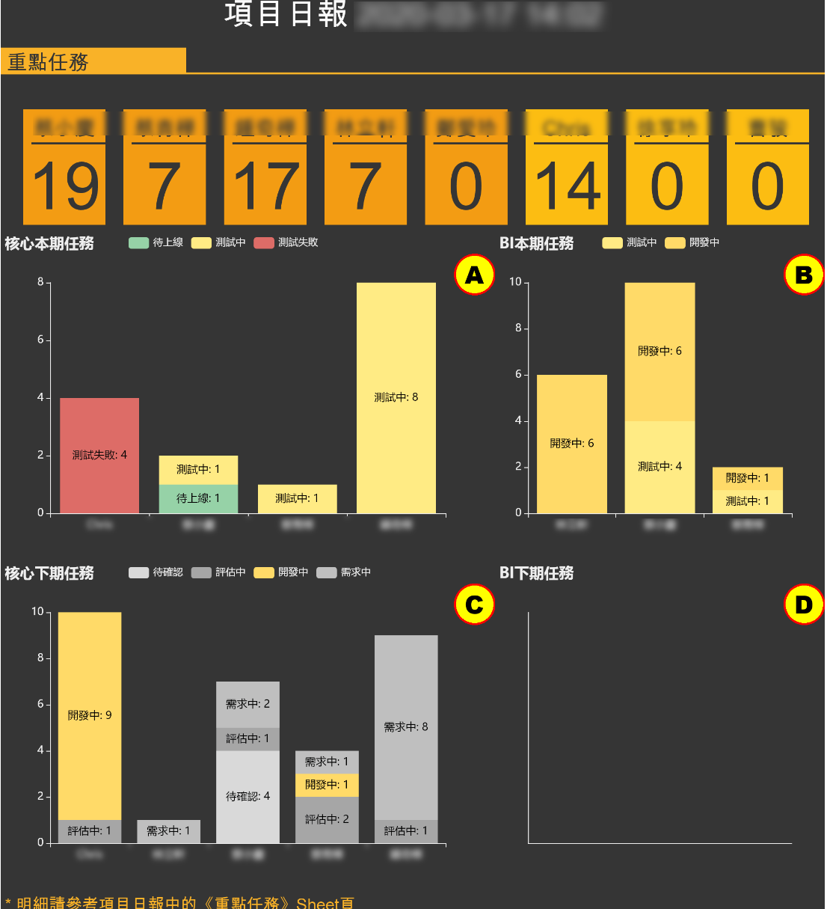


## 核心未關閉BUG

數據來源於TAPD中登記的缺陷，過濾掉了已經關閉的缺陷。

1. 可以按模塊來查看各個模塊的缺陷數量。
2. 可以查看各種BUG的狀態。具體狀態請參考管理文檔中的約定。

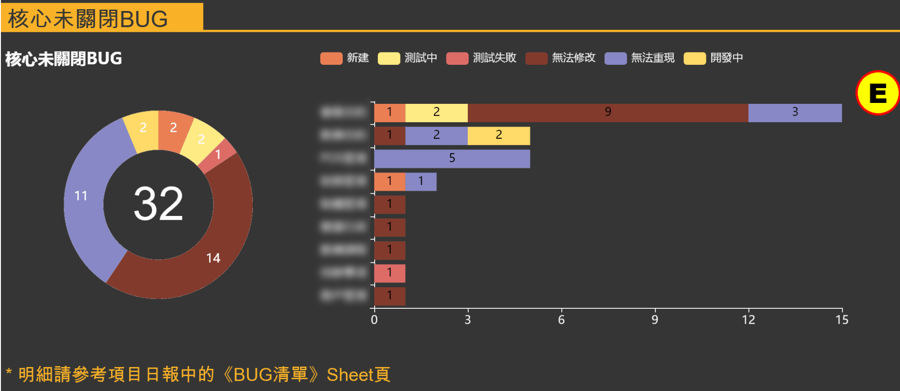

## 核心測試概覽

 此區域顯示當前版本（最新在測試環境中的版本）測試狀況。

數據來自於各測試人員發出的測試報告。

> <font color="red">★★★ 識別為【高】級別的測試用例若無法測試通過則無法上線發佈。</font>
>
> 即：如下圖中 G圖中 若有紅色區域，則無法上線。

具體明細參考EXCEL檔中對應的SHEET頁。

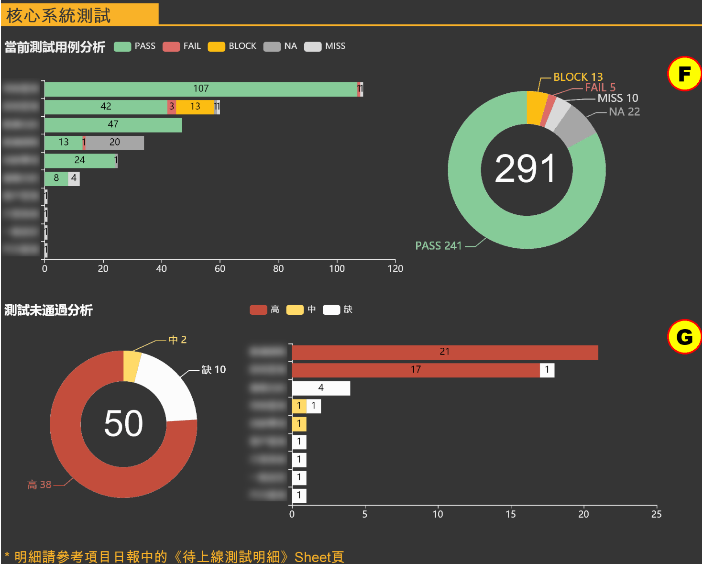

> 用例提示為【MISS】或【缺】表示當前缺少對此功能的用例。如果一個功能有新需求發佈，至少需要有一個用例與之對應。
>
> 範圍僅限本次擬發佈的功能，按模塊來進行查看。

## 系統交付狀況

顯示當前階段的交付狀況。交付指已經上線發佈。

圖中顯示交付比例，按需求項數量來進行計算。

可按核心與BI兩個系統獨立查看各需求的交付狀態。

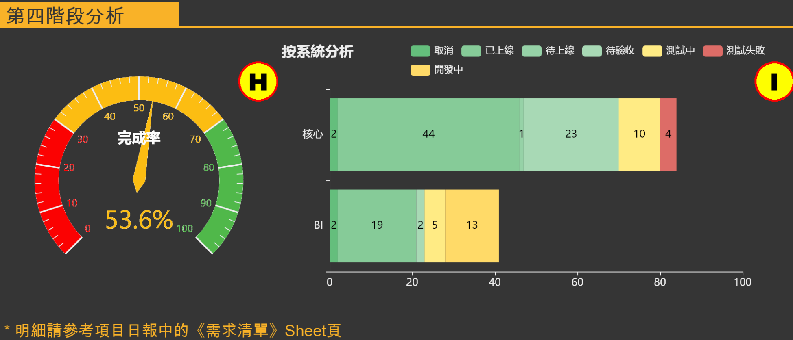


## 系統用例庫狀態

系統整體模塊用例庫建設狀況。需逐步補充完善。

數據取自各自發出的最新測試報告中包含的用例。

>  目標：所有功能點都應該有用例覆蓋，且每個BUG都有對應用例，避免隨意測試出BUG。

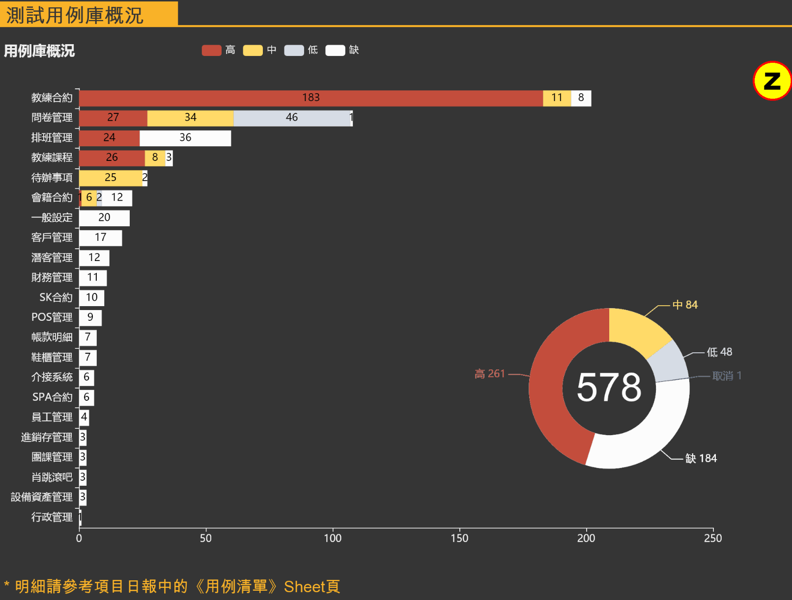

# 項目日報明細

## 重點任務

1. 包含BI與核心功能。
2. 包含需求與BUG內容。
   1. 需求包括下個月前需交付給客戶的所有需求清單。
   2. BUG包括所有未關閉內容均。因BUG應該是優先處理的內容。
3. <font color="red">下月核心計劃糾紛的內容，本月需求需評審通過，包括開發&客戶雙方均確認。</font>

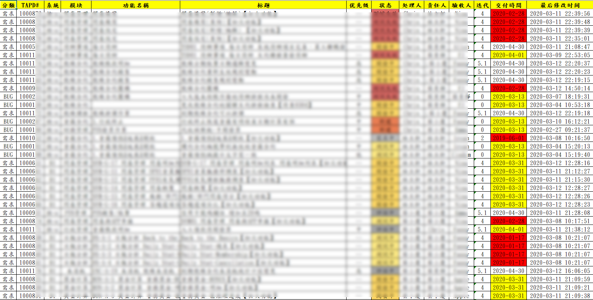

> 交付時間背景色為紅色標識已經超期，或與客戶協調新的時間，或盡快趕上進度。
>
> 交付時間背景色為黃色標識未來30天內需交付。

## 待上線測試概覽

本月準備交付的版本的功能清單，僅適用核心系統。

* 重點查看計劃上線功能的測試執行情況，通過率等信息。

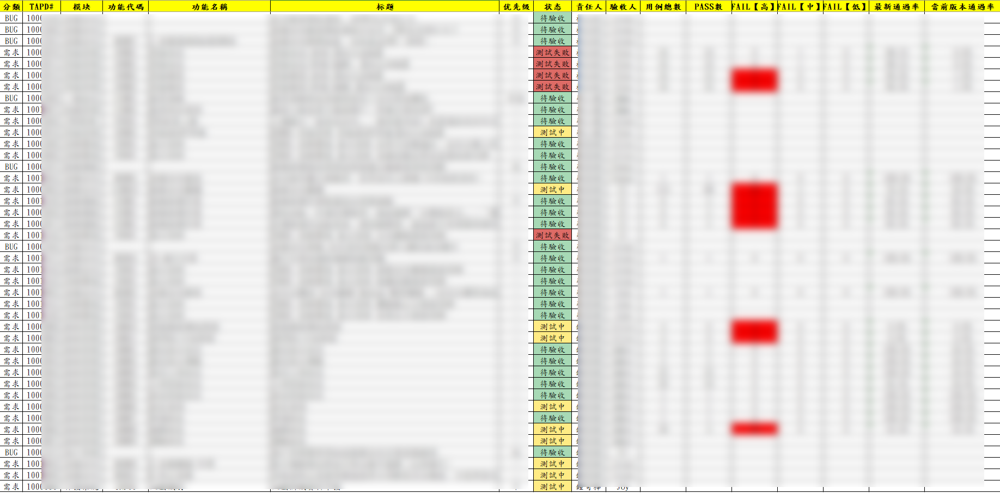

欄位說明：

1. 用例總數：這個功能在系統用例庫中的用例總數量，若為空，表示對應功能沒有正式入庫的測試用例。
2. PASS數：這個功能最後一次測試通過的數量，這個數量 與 用例總數相同時，表示此功能無BUG。
3. FAIL數【高】：測試失敗且用例等級為【高】的用例，在系統上線前，此數量必須為0，否則會造成系統無法正常工作。<font color="red">版本可上線發佈的必要條件為此處數值為0</font>。
4. FAIL數【中】：測試失敗且用例等級為【中】的用例，在項目驗收前，此數量必須為0，否則無法驗收，即：可以上線，但是這個BUG需要修正。
5. FAIL數【低】：測試失敗且用例等級為【低】的用例，不影響項目驗收，但是影響用戶體驗。
6. 最新通過率：指最後一次測試（但不一定是最新版本）時的通過狀況與總用例的比值。
7. 當前版本通過率：指在最新版本上測試通過的用例數。在正式發佈前，原則上需要對所有涉及用例進行回歸測試，但不作為上線的必要條件。

> 此清單也用作UAT測試計劃。
>
> 根據每個項目的狀態來判別UAT測試情況。

```
清單包含BUG與需求，其中BUG僅包含用戶感知的BUG。
清單中無論需求還是BUG，都必須有唯一對應的功能，如有缺少，請及時補齊。
```

## 待上線測試明細

本月準備交付的版本的測試狀況。

> 僅包含待發佈上線功能涉及測試用例。
>
> 要求在上線版本中【高】級別用例全部測試通過。
>
> 清單排序按 用例等級 排序。

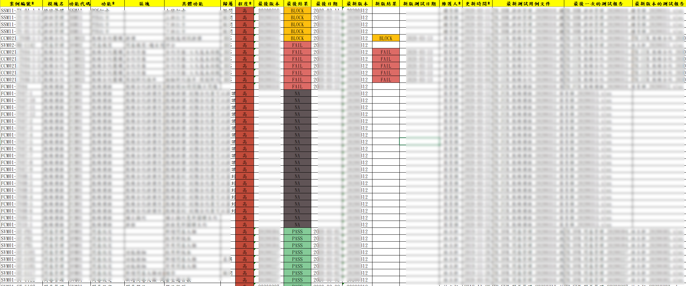

欄位說明：

1. 案例編號：測試用例的唯一編號
2. 程度：測試用例等級
3. 最後版本：最後一次執行此測試用例的系統版本。
4. 最後結果：最後一次執行此測試用例的測試結果。
5. 最後日期：最後一次執行此測試用例的測試日期。
6. 最新版本：最新的測試版本。

其他欄位信息可參考 [測試用例文件](#測試用例文件) 中的相關說明

```
針對缺失的用例，結果標記為【MISS】的必須補齊，所以擬上線功能必須有用例覆蓋可進行測試。
```

## 用例清單

系統測試用例匯總，可以查看每個用例最後一次測試的執行情況和當前版本的測試情況。

此清單包含了系統所有全部測試用例。

> 此表來源於測試報告（或測試用例）文件，是對其的匯總，可查看所有歸檔的測試用例。
>
> 可查看用例的原始文件名，並在項目文檔庫中依名稱查到對應的文件。

**僅適用於核心**

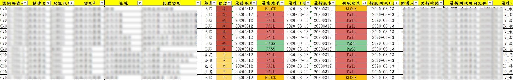


## 功能清單

系統功能清單，包含核心與BI

* 可查看當前功能對應的測試用例數量。


## 需求清單

當前項目所有需求清單，含需求執行情況。

> 來源於TAPD所有的需求明細。

1. 包含所有用戶需求。
2. 包含已經上線及未上線的。
3. 包含BI及核心。
4. 可以查看每個需求的來源信息。
5. 可查看需求的最新狀態。

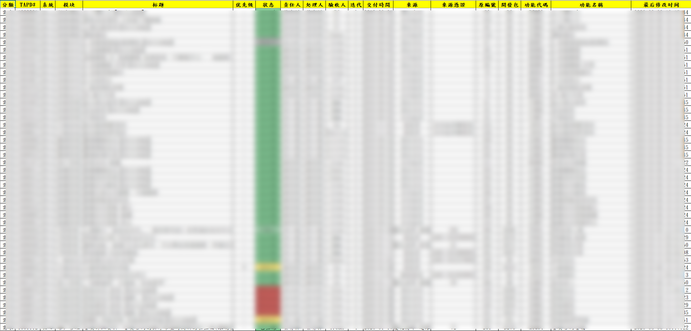

欄位提示：

1. 開發包：原google表單上對應的開發包編號，會逐步淘汰，僅為追溯用。

## BUG清單

系統中所有未關閉BUG清單，不包括已經關閉的，和無法重現的BUG。

> 僅適用與核心系統

## 未交付合約項

原合約約定內容，尚未交付的內容清單。

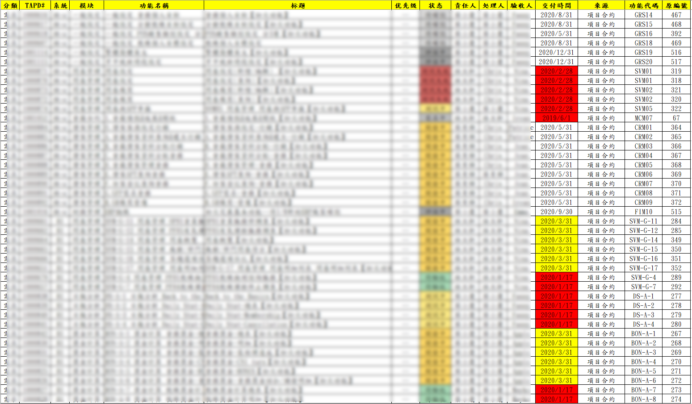


## 今日變更

今日對任務的修改清單，便於查看今日變動。

# 測試用例

## 設計思想與原則

1.    可追溯原則。測試用例需能在需求文檔中找到依據，若需求文檔缺少相關依據，先更新需求文檔。且測試用例需和系統功能關聯，要求每個用例都可以追蹤到具體的系統功能編號。
2.    複用性原則。開發團隊針對功能的自測，測試團隊驗證測試，測試團隊集成回歸測試，用戶UAT測試均用同一套測試用例（具體測試用例項目可依實際情況裁剪）。開發完成驗證通過的後再發佈版本，部署測試環境。功能驗證測試通過後，經PM確認為可鎖定版本後進行集成測試與回歸測試。回歸測試通過後，達到可UAT標準後進行UAT測試。
3.    關聯性原則。BUG一定和某個測試用例關聯，即：BUG一定是某個測試用例未通過。不應該存在某個BUG是沒有對應測試用例的，若測試用例缺少，提BUG前先補用例。若測試用例描述不清，先修改測試用例，再說明測試失敗。
4.    維護性原則。測試用例在實際測試時或其他時間，發現原測試用例有漏洞或瑕疵，可隨時增加，修改或刪除。但是對每個用例的更改，都需同步更新對應的用例維護人及修改時間。
5.    三合一原則。測試用例，測試報告，BUG報告三個文件為同一格式文件。需求完成交付開發前，測試用例應已經編寫完成發給開發團隊，此時對應的測試結果留空即可。當新的版本發佈後，依版本複製新的測試用例文件，測試完成更新測試結果後，此文件就是測試報告，反饋給開發。

## 測試用例庫

1. 測試用例庫存放歷史的測試用例三合一文件。
2. 每次測試完成後均會產生一份測試文件。

> 愛數存放歷史測試報告。
>
> 每個文件最新的測試報告構成測試用例庫。

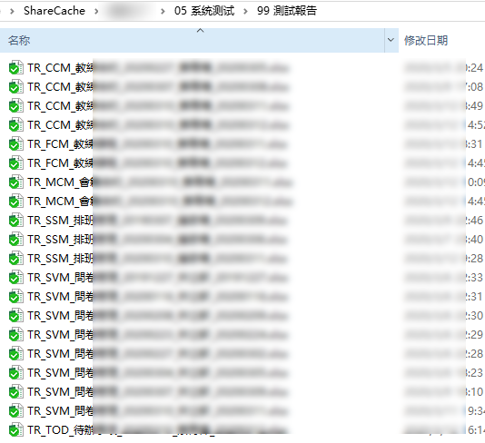

## 測試用例文件

### 命名規範

1. 測試用例（不含測試結果的文件，交付需求時提供）

TC\_[模塊編碼]\_[模塊名稱]\_測試用例\_[發佈人員]\_[發佈日期]

舉例：TC_SVM\_問卷模塊\_測試用例\_XXX\_20200305

2. 測試報告（包含測試結果的文件,功能模塊的測試或集成測試）

TR\_[模塊編碼]\_[模塊名稱]\_[系統版本]\_[測試人員]\_[測試日期]

舉例：TR_SVM\_問卷模塊\_20200304\_XXX\_20200305 

### 文件說明

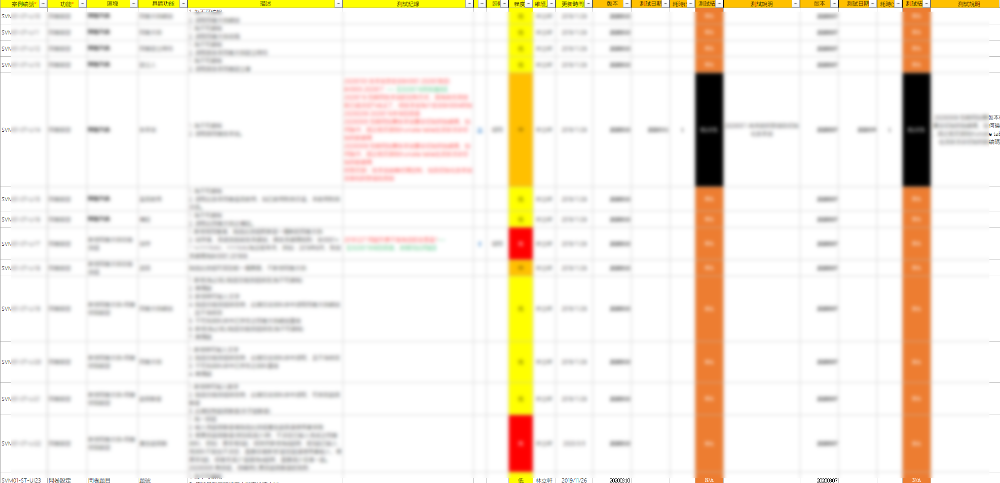

1. 案例編號：必填。測試用例編號。唯一編號。編號前綴需為系統功能編號，若發現系統功能編號不合理，需先修改系統功能編號（聯繫PM或需求組負責人）。

```
編碼規則：功能代碼-自由編碼 ，範例：SSM04-TV-01-1-5    SVM01-B01   CCM021-TV03-2-2
重點：功能代碼必須與需求中的功能編碼一致，功能編碼後為短橫線。
```

2. 功能：必填。與系統的功能名稱一致。

3. 區塊：非必填，依實際測試選擇的進一步分級分類。

4. 具體功能：非必填，依實際測試選擇的進一步分級分類。

5. 描述：必填。對測試用例的描述，可引用相關的需求文件，或其他可檢索文件（此類文件必須歸檔存放，且做版本控制的）。

6. 測試記錄：非必填。便於查看歷史測試記錄。

7. 圖：非必填。建議直接加超鏈接，連接到對應的頁簽。

8. 歸屬：非必填。選項如下：BUG（明確當前有BUG），差異（與開發或客戶理解不一致），疑問（有疑問項，待客戶或開發回復說明）

9. 程度：必填。標記當前用例的重要性。選項如下：高（若此用例有BUG，不可以發佈或上線），中（此處有BUG，允許上線，但是必須修復），低（有BUG或問題，但是不修正，不影響正常使用），取消（曾經的用例，現在已經作廢，僅為方便查看而保留）。

10. 維護人：必填。最後一次更新當前用例的人員。修改【描述】或【程度】字段後，必須更新此欄位。

11. 更新時間：必填。最後一次更新當前用例的日期。修改【描述】或【程度】字段後，必須更新此欄位。

12. 版本：測試報告必填。當前針對哪個版本進行測試。

13. 測試日期：測試報告測試後必填。

14. 耗時（分）：測試報告測試後必填。測試當前用例花費時間。

15. 測試結果：測試報告測試後必填。選項如下：PASS（測試通過），FAIL（測試失敗），BLOCK（阻塞，當前版本無法執行此測試），NA（未測，因前版本已經測試通過，或其他原因未進行測試）。  

    > NA表示：你原本就不計劃測試，因為功能原本就沒有開發好，或是之前版本是PASS的，這個版本你不計劃測。主觀上放棄不測的，都算NA。
    > BLOCK表示：你主觀意願是要測試的。但是系統無法執行下去，或者無法使用，或對功能有疑問，無法給出PASS或FAIL結論的。都算BLOCK。
    >
    > <font color="red">NA更傾向說明是之前PASS過，這次不想測。 </font>
    >
    > <font color="red">BLOCK更傾向於是本質是FAIL，雖然我沒有去測。</font>

16. 測試說明：測試報告測試後選填。補充說明測試結果。  

<font color="red">特別提示：欄位名稱不可隨意變更</font>

### 其他約定

1. 版本部署後的兩個工作日內應該發送測試報告，若有特例，需提前告知開發團隊，需求負責人，PM。
2. 文件完成後，需在微信群發送，同時郵件發送給開發團隊，需求負責人，PM。
3. 測試完成後，對應的功能狀態需及時更新，同時附上測試報告（可直接附件或 寫測試報告文件名）。

### 操作建議

1. 測試時，僅需複製最新一版的測試用例或報告，然後清空測試結果相關欄位後，直接填寫當前測試信息即可。
2. 針對非確認的最終發佈版（PM會依實際整體測試情況決定哪個版本作為 鎖定發佈版），可僅測試上次測試失敗的內容，無需全部測試。
3. 針對鎖定版本（擬升級更新版本），需對當前版本的所有用例進行測試，同一版本同一用例之前測試通過的可不複測。

# 需求管理（TAPD）

## 相關約定

### 預計結束日期

請以每個月的月末或月中為約定日期。如：4/15，4/30。不要以4/1這樣的日期作為交付日期。

預計結束日期在需求狀態變更為 已上線 時，對應的日期就是上線日期（交付日期）。

通常雙週會依實際項目推進狀況進行一次日期調整。

# 缺陷管理（TAPD）


